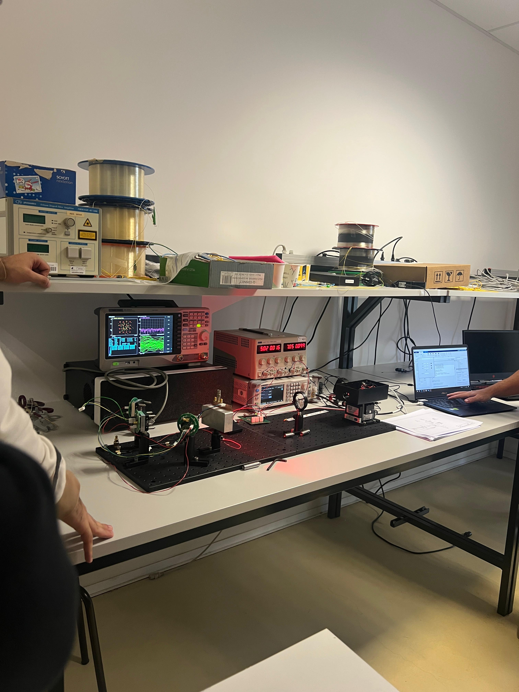

# RGB BLE Controller — Android Application
 
Android application for wireless RGB LED control over **Bluetooth Low Energy (BLE)**, communicating with an ESP32 microcontroller via the Nordic UART Service (NUS) profile.
 
> **Status: Work in progress** — part of an ongoing Final Year Project at the University of Aveiro. Full source code is not publicly available; this repository serves as a project showcase.
 
---
 
## Overview
 
The app provides a real-time colour-picking interface (HSV colour wheel + brightness control) and streams 8-bit RGB values to an ESP32 over BLE. The ESP32 parses the incoming values and drives an RGB LED accordingly.
 
This is one component of a larger multi-subsystem final year project involving visible light communication (VLC). The Android application handles the wireless control layer.


 
---
 
## System Architecture
 
```
┌─────────────────────┐         BLE / NUS          ┌──────────────────────┐
│   Android App       │ ─────────────────────────▶ │   ESP32 Firmware     │
│   (GATT Client)     │    "R,G,B\n"  ASCII         │   (GATT Server)      │
│                     │    up to 20 bytes/packet    │                      │
│  • Colour wheel UI  │                             │  • NUS service       │
│  • Brightness bar   │                             │  • RGB LED driver    │
│  • BLE scan/connect │                             │  • Arduino C++       │
└─────────────────────┘                             └──────────────────────┘
```
 
**Communication stack:** BLE → GATT → Nordic UART Service (NUS)
**Payload format:** ASCII `"R,G,B\n"` — e.g. `"255,0,128\n"` (max 12 bytes, well within ATT MTU)
 
---
 
## Key Technical Details
 
**Android app (Java)**
- Target SDK range: API 21 (Android 5.0) through API 36
- Explicit handling of the Android 12 (API 31) runtime BLE permission model
- Event-driven, non-blocking architecture — no busy-wait loops
- 50 ms debounce on outgoing writes to coalesce rapid slider events
- Write guard (`isWriting` volatile flag) to prevent GATT queue overflow
- Two-phase GATT cleanup: `disconnect()` → wait for `STATE_DISCONNECTED` → `close()`
- Dual API path for `writeCharacteristic()`: deprecated (`<API 33`) and new overload (`API 33+`)
 
**ESP32 firmware (Arduino C++)**
- Advertises NUS service with standard UUIDs
- Receives `"R,G,B\n"` strings, parses on comma delimiter, drives LED
 
---
 
## BLE Communication Parameters
 
| Parameter | Value |
|---|---|
| BLE profile | Nordic UART Service (NUS) |
| Service UUID | `6E400001-B5A3-F393-E0A9-E50E24DCCA9E` |
| Write characteristic UUID | `6E400002-B5A3-F393-E0A9-E50E24DCCA9E` |
| Write type | `WRITE_TYPE_DEFAULT` (acknowledged) |
| Payload encoding | ASCII text |
| Max payload used | 12 bytes (`"255,255,255\n"`) |
 
---
 
## Notable Implementation Challenges
 
- **GATT write queue overflow** — solved with debounce + write guard; without this, rapid slider movement silently drops packets
- **Two-phase GATT close race** — calling `close()` immediately on disconnect can leave the socket half-open; fixed by waiting for the `STATE_DISCONNECTED` callback
- **API 31 permission split** — `BLUETOOTH_SCAN` and `BLUETOOTH_CONNECT` became runtime permissions in Android 12; handled with version-aware checks at every BLE entry point
- **Lazy scanner init** — `getBluetoothLeScanner()` returns null before permissions propagate; deferred to the moment it is actually needed
 
---
 
## Known Limitations
 
- No write-acknowledgement watchdog: if the link drops mid-write, `isWriting` stays `true` and the app stops sending updates until reconnected
- Single-device scan: connects to the first device named `ESP32_RGB`; no multi-device selection
- No automatic reconnection after unexpected disconnect
- No MTU negotiation (uses default 23-byte ATT MTU)
 
---
 
## Project Context
 
This application is one subsystem of a larger Final Year Project at the **University of Aveiro (DETI)**, developed within a 13-person cross-functional team. The broader project involves a visible light communication (VLC) circuit operating at 24.9 MHz, with the Android app providing the wireless control interface.
 
Full source code remains private due to academic licensing requirements.
 
---
 
## Tech Stack
 
`Java` `Android Studio` `Bluetooth Low Energy` `GATT` `Nordic UART Service` `ESP32` `Arduino C++`
 
